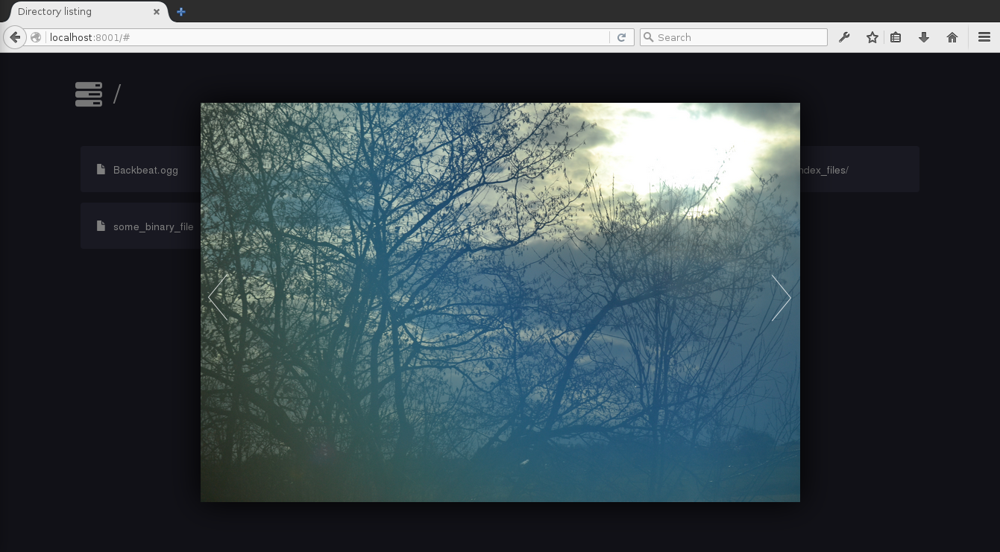

HTML5 file browser
---

This HTML5 file browser allows to browse and share files in a public server directory. Unlike some other solutions out there, this file browser does not depend on any server-side code. Instead, directory listings are used to parse the list of available files.



### Configuration
#### Apache
This program comes with a `.htaccess` file that enables directory listings for the `files/` directory. Simply upload this file browser to any directory on your server and you are done.

#### Nginx
For `nginx`, auto-indexing has to be turned on for the `/files/` directory:
```
location /somedir/files/ {
    autoindex on;
}
```

#### Python
For testing purposes or to share files in a LAN, Python can be used. Run `python -m http.server 8080` (or `python2 -m SimpleHTTPServer 8080` if your system is  horribly outdated) from within this directory (the directory where `README.md` can be found) and you are done.

### License
This program is free software: you can redistribute it and/or modify
it under the terms of the GNU General Public License as published by
the Free Software Foundation, either version 3 of the License, or
(at your option) any later version.
